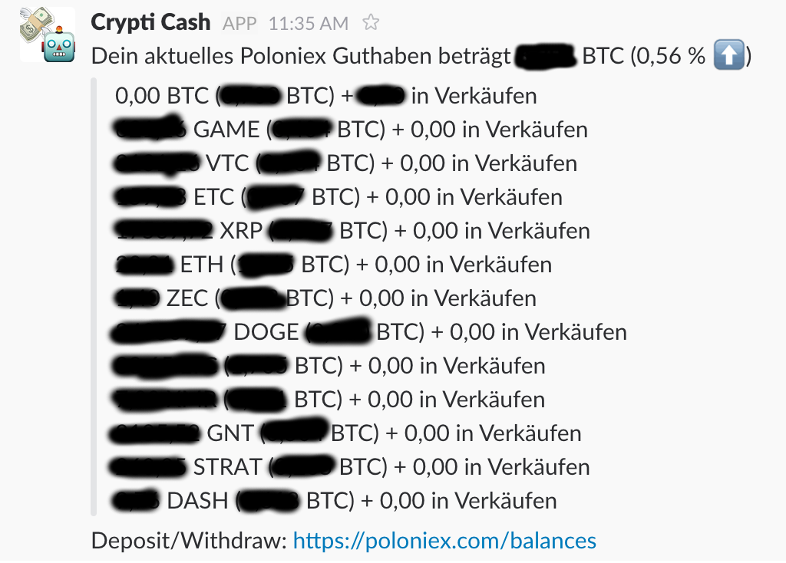

## cryptoalerts
### Alerting and Reporting on Crypto Currencies @ Poloniex

Cryptoalerts is a fully configurable Slack bot with the purpose of serving a Slack team alerts and reports about crypto currency prices and developments at Poloniex.com

Its goal is to support crypto-currency-enthusiastic investors and traders to make decisions about selling and buying and keeping track of their wins and losses.

Unfortunately its messages are currently *only in German*. You want internationalization? [Let's talk about it](https://github.com/jverhoelen/cryptoalerts/issues/1).

### Features

It contains features such as:

- Alerting configured course changes within a time frame of currency combinations (e.g. ETH in BTC) in the currencies' channel (eg. #ethereum)
- Half hourly & daily statistics on all tracked currency combinations
- Maintaining Poloniex API credentials in relation to Slack team members
- Hourly & daily reports on their portfolio (sum of all in BTC, currencies available and for sale)
- Proposals for channels to join because there are amounts of a currency in portfolio
- Selling & buying a currency by in-channel-message

Sounds good? Wanna join? Read further (feature screenshots below at "Feature screenshots")

### Come aboard!

Got some crypto currencies you want to keep track of? Preferably on Poloniex? [Join the Slack team](https://join.slack.com/cryptoalertsteam/shared_invite/MTgwNjIxMDkzMDE1LTE0OTQxMTI3NjQtMTg3NjI5YWM4Zg) – it is free and will be forever.

Why do I share this? [Cryptoalerts](https://cryptoalertsteam.slack.com) started as my idea and fun project to build simple things that help me as much as possible. I started inviting some people for feedback, ideas and their expertise and technical course analysis. I want to continue with this idea and share Cryptoalerts functionality with everyone because I believe in crypto currencies and cryptos profit from more people getting into it. Feel free to share with your mates.

[Invite link](https://join.slack.com/cryptoalertsteam/shared_invite/MTgwNjIxMDkzMDE1LTE0OTQxMTI3NjQtMTg3NjI5YWM4Zg) expired? Just contact me so I will generate a new one or send me your email address for an invite.

### Cool, I'm in. What now?

@greeter should've greet you in #general, also mentioning everything you need to use the capabilities of Slack and Cryptoalerts together.

### Feature screenshots

#### Balance reports

#### Course change alerts

#### Crypto channel suggestions

#### Adding watched & alerted currencies by command

#### Sells and buys notifications

#### 30 min and daily statistics

#### Adding watched timeframes by command

#### Adding Poloniex users

### Development progress

At the moment Github issues is *not used*, I decided to go for a [Trello board](https://trello.com/b/c9xsCoIt/cryptoalertsteam-slack-com). As I appreciate you as a contributor, I'm open to change that decision again ;-)

### How can I help?

- Contributing (development, feedback, ideas)
- Voluntary Bitcoin donations (wallet-ID: `1HNkn4FnnuFfGxhTnHT8ijPSxLdM7k22Gi`)

#### Own team setup

What you need:

- Operating a Spring Boot application
- A slack team with the channels #general, #statistik, #tages-statistik and #admin (closed one, only with admins invited)
- Adding a custom bot as app so that you have an access token of it
- Configuring `application.properties` with all needed data, e.g. the admins' Poloniex API credentials 

If you can do that, the rest will be easy for you.